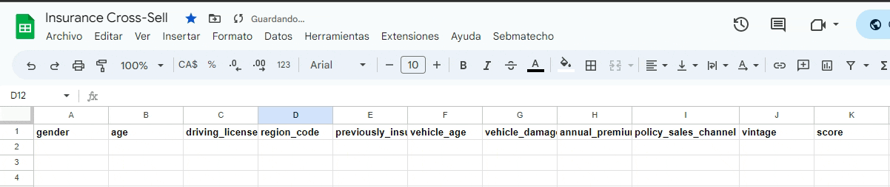
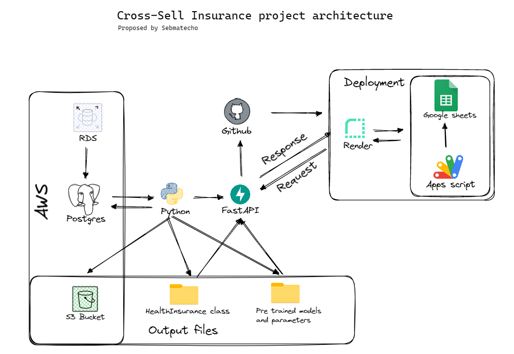

# Insurance Cross-selling Ranking Project
#### Proposed by [Sébastien Lozano-Forero](https://www.linkedin.com/in/sebastienlozanoforero/).

This repository contains all materials developed for the Insurance Cross-selling Ranking project. This aims to be an end-to-end data product intended to showcase data science skills. 

## Business Context 

A marketing campaing aiming to increase cross-sell rates within an insurance company is going to be held. The featuring product for such campaing is vehicle insurance and is expected to target current life insurace policyholders. During the first iteration of such campaing, data pieces involving demographics (gender, age, region), Vehicles (Vehicle Age, Damage), Policy (Premium, sourcing channel) and of course, end result for this campaing, were collected. The insurance company is interested in better targeting potential clients based on what was learnt for later iterations of such campaing. 

## Project Objective

This project proposes an automatic way to rank clients on next iterations of such campaing, sorting them by likelihood of being interested in the product. The implementation of the this proposal would imply that reaching the top 20% of the ranked clients will lead to the 90% of the expected outcome of the entire campaign. Being able to prioritize clients would be of tremendous use to the managers as communication strategy can be adjusted accordingly leading to optimized business model, resources usage and revenue.  

## Bussiness Impact

As described above, business context implies carrying out a marketing campaign. Let us assume these assumptions: 
- 1M clients are to be reached telephonically to be told about the product
- average of 12 calls per hour per agent
- average agent salary 20 USD/hour 

In such cases **The estimate cost of such campaing without using our solution is about $1.6M USD. The estimate cost using our solution is about $330K USD**. This is, campaing costs are reduced by about 80%.

## Demo

If the Google Apps Script API is enabled in your gmail account settings, you are more than welcome to try it out [here](https://docs.google.com/spreadsheets/d/1WUQPmwvzYX_OY9WIVluOEKeaUD4erhhSXdbbLip4ElY/edit?usp=sharing). Please, be mindful that the API was deployed on a free tier resources, so it might take a while (30-60 secs). 

You can propose your own selection of values for the variables, but if you need a starting point, there you go: 

```
Male	33	1	15	0	1-2 Year	Yes	28267	154	269
Female	69	1	28	0	1-2 Year	Yes	25126	124	98
Male	23	1	26	0	< 1 Year	Yes	46132	160	180
```

Once pasted, hit the *Sebmatecho* menu and select the *Get Prediction* option. You will get a predicted probability for such person to be interested into the producted being promoted. 



## Data
The data used for this project was obtained from Kaggle (description and further details available [here](https://www.kaggle.com/datasets/anmolkumar/health-insurance-cross-sell-prediction)) and it involves an insurance company's database containing information about existing customers who were targeted in the first iteration of cross-selling campaign. The dataset includes the following variables:

- Gender: Gender of the customer
- Age: Age of the customer
- Driving License: 0 (Customer does not have DL), 1 (Customer already has DL)
- Region Code: Unique code for the region of the customer
- Previously Insured: 1 (Customer already has Vehicle Insurance), 0 (Customer doesn't have Vehicle Insurance)
- Vehicle Age: Age of the Vehicle
- Vehicle Damage: 1 (Customer got his/her vehicle damaged in the past), 0 (Customer didn't get his/her vehicle damaged in the past)
- Annual Premium: The amount customer needs to pay as premium in the year
- Policy Sales Channel: Anonymized Code for the channel of outreaching to the customer ie. Different Agents, Over Mail, Over Phone, In Person, etc.
- Vintage: Number of Days, Customer has been associated with the company

For training data, the target variable was given by
- Response:  1 (Customer is interested), 0 (Customer is not interested)

## Model
The model used in this project is an XGBoost model that was fine-tuned using a Bayesian optimization approach. The model was trained on the historical data obtained from previous campaigns, and the output is a ranking score that ranks the customers by their probability of purchase. As the main problem is to sort the list of clients the metrics [Cumulative Gain Curve](http://mlwiki.org/index.php/Cumulative_Gain_Chart) and [Lift Curves](https://www.geeksforgeeks.org/understanding-gain-chart-and-lift-chart/) were used to assess model performance. 

Also, assuming a traditional threshold of 0.5, this model can be seen as a classification model, so [ROC and AUC](https://developers.google.com/machine-learning/crash-course/classification/roc-and-auc?hl=en) metrics are also used (and thus these were the initial assessment method on Kaggle's original competition). 

The selected model performed consistently higher on all considered metrics (metrics for other considered models are available on notebooks) and thus was selected for deployment. 


## API
The model was deployed through a FastAPI API that is hosted on Render. The API accepts a JSON file containing the variables for each customer and returns a JSON file containing the ranking score for each customer. The API was tested using Pytest. Tests are still to be included in the repository.

## Project Deployment

A bayesian fined tuned XGBoost model (predicting the probability of clients being interested in the product) was deployed through a FastAPI API hosted on Render and is available to use on a google sheets spreadsheet. 

The general overview and some of the technologies used for deploying this project is presented as follows: 



 
## Future work

This project could use the following steps for a next iteration: 

- Writing test for the API functionalities and the InsuranceClass class
- Propose ranking models based in neuronal networks
- Expand the API usage to allow final user to select model to be used
- Develop infrastructure for seasonal retraining of the model with fresh data


