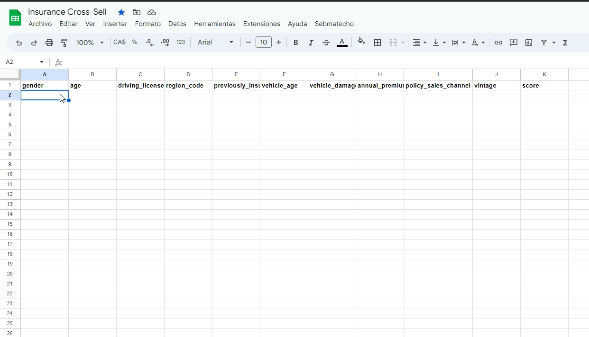
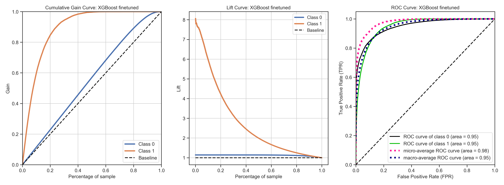
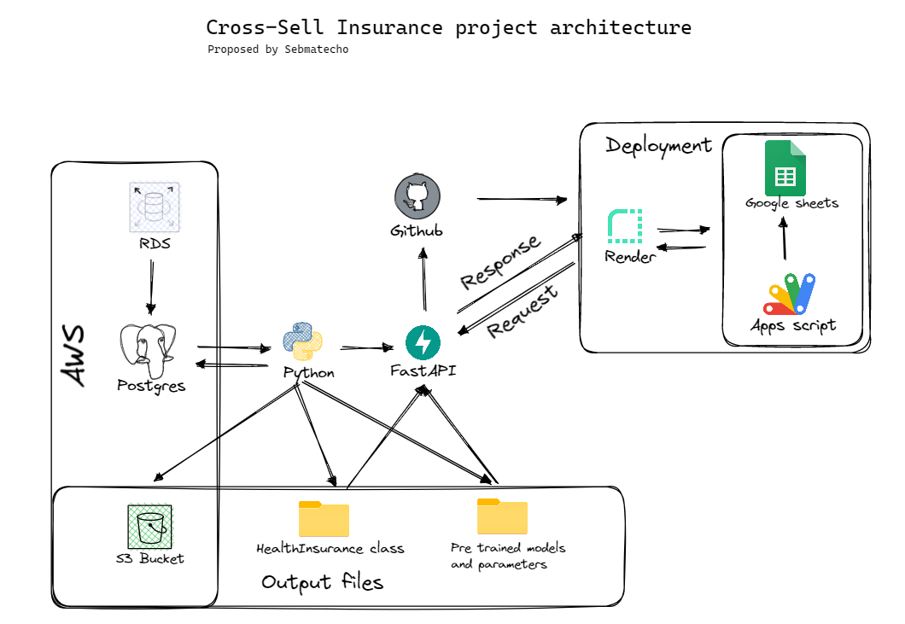

# Insurance Cross-selling Ranking Model
This is an end-to-end project is to showcase a ranking model developed to assist decision making in a marketing campaign within an insurance company looking to increase the cross-selling rates. The project was developed using Python. A XGBoost model fined tuned based on a bayesian approach, deployed through a FastAPI API hosted on render and available to public use in a google sheets spreadsheet.

If the Google Apps Script API is enabled in your gmail account settings, you are more than welcome to try it out [here](https://docs.google.com/spreadsheets/d/1WUQPmwvzYX_OY9WIVluOEKeaUD4erhhSXdbbLip4ElY/edit?usp=sharing). Please, be mindful that the API was deployed on a free tier resources, so it might take a while (30-60 secs). 

You can propose your own selection of variables, but if you need a starting point, there you go: 
```
Male	33	1	15	0	1-2 Year	Yes	28267	154	269
Female	69	1	28	0	1-2 Year	Yes	25126	124	98
Male	23	1	26	0	< 1 Year	Yes	46132	160	180
```
Once pasted, in *Sebmatecho* select the *Get Prediction* option. You will get predictions for the proposed profile. 



## Objective
The objective of this project is to develop a ranking model to predict the probability of purchase of new clients in a marketing campaign to cross-sell an insurance product to existing customers. The model is trained on historical data obtained from previous campaigns, and the output is a ranking score that ranks the customers by their probability of purchase.

## Data
The data used for this project was obtained from the insurance company's database and contains information about existing customers who were targeted in previous cross-selling campaigns. The dataset includes the following variables:

- Gender: Gender of the customer
- Age: Age of the customer
- Driving License: 0 (Customer does not have DL), 1 (Customer already has DL)
- Region Code: Unique code for the region of the customer
- Previously Insured: 1 (Customer already has Vehicle Insurance), 0 (Customer doesn't have Vehicle Insurance)
- Vehicle Age: Age of the Vehicle
- Vehicle Damage: 1 (Customer got his/her vehicle damaged in the past), 0 (Customer didn't get his/her vehicle damaged in the past)
- Annual Premium: The amount customer needs to pay as premium in the year
- Policy Sales Channel: Anonymized Code for the channel of outreaching to the customer ie. Different Agents, Over Mail, Over Phone, In Person, etc.
- Vintage: Number of Days, Customer has been associated with the company

For training data, the target variable was given by
- Response:  1 (Customer is interested), 0 (Customer is not interested)


## Model
The model used in this project is an XGBoost model that was fine-tuned using a Bayesian optimization approach. The model was trained on the historical data obtained from previous campaigns, and the output is a ranking score that ranks the customers by their probability of purchase.



## API
The model was deployed through a FastAPI API that is hosted on AWS Lambda. The API accepts a JSON file containing the variables for each customer and returns a JSON file containing the ranking score for each customer. The API was tested using Pytest, and the tests are included in the repository.


## Project Deployment

The general overview for the deployment of this project is presented as follows: 




